# Presenton Local Docker Deployment Demo

本 GitHub 倉庫是一個簡單的 LLM 驅動簡報幻燈片生成工具 [Presenton](https://github.com/presenton/presenton) 示範 -- ***開源 AI 簡報生成器和 API (Gamma, Beautiful AI, Decktopus 替代方案)***

> Presenton 是一個開源應用程式，用於透過 AI 生成簡報 — 全部在您的裝置上本地運行。在使用 OpenAI 和 Gemini 等模型時保持對資料和隱私的控制，或透過 Ollama 使用您自己託管的模型。

此示範旨在向觀眾展示：
* 使用 Docker，特別是 [Docker Desktop](https://docs.docker.com/desktop/) 在本地部署 Presenton。
  > 如果您的電腦已安裝 Docker Desktop，我想您已具備足夠的技術能力來跟隨這裡顯示的步驟。
* 將 Presenton 與 [OpenRouter](https://openrouter.ai/) LLM 閘道器連接，以按用量付費的方式使用選定的模型。
  > 是的，您需要為使用的 LLM 服務付費。但是，除非您是非常重度的使用者，否則費用應該不會太高。
* 將 Presenton 與 [Pixabay API](https://pixabay.com/service/about/api/) 連接以進行圖像[自動]來源獲取。
  > 這是一項免費服務。
     

# OpenRouter 帳戶設置

要設置 OpenRouter 帳戶，請前往 [OpenRouter.ai](https://openrouter.ai/)

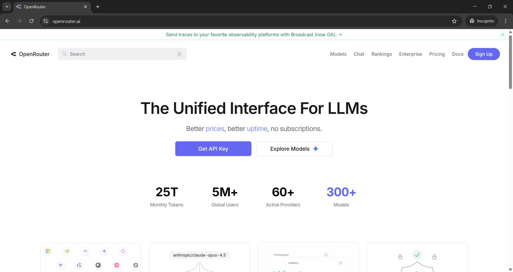

如果還沒有，請註冊一個帳戶。您可以使用您的 Google 帳戶進行註冊。

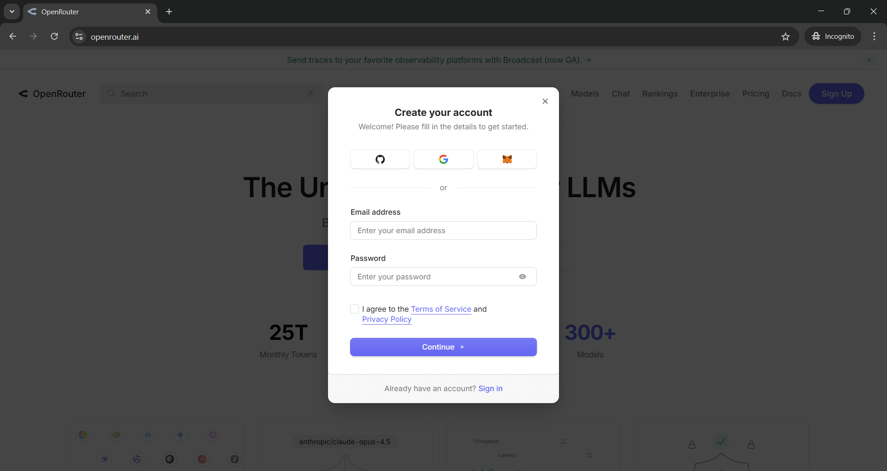

然後，您可能想要做的第一件事是查看 OpenRouter 的定價/計費系統
* 您使用預購的點數 -- 美元 -- 為您使用的服務付費。
* 不同模型有不同的計費費率。模型越強大，費率越高。
  例如，截至 2026-02-01，`DeepSeek V3.2` 每百萬輸入令牌成本 $0.25，每百萬輸出令牌成本 $0.38。
  簡而言之，如果您的輸入提示有 100 萬個單詞，您大約需要支付 $0.25，如果模型生成的輸出有 100 萬個單詞，您需要支付 $0.38。請注意，您可以選擇一些免費模型；例如 `DeepSeek: R1 0528` 是免費的。

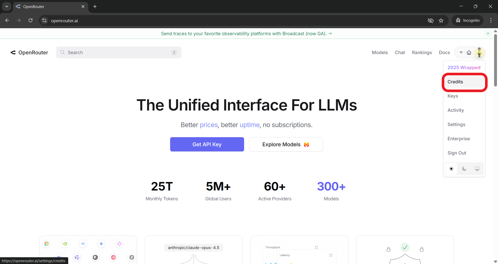
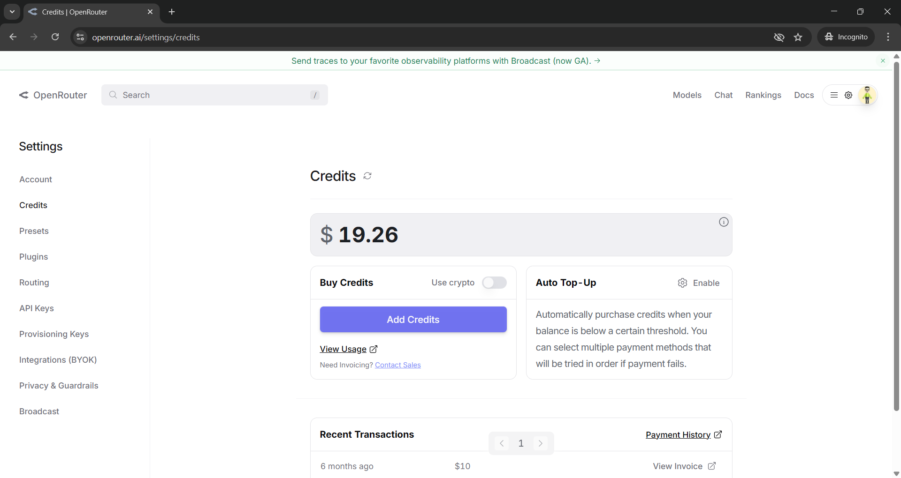

由於您將使用 OpenRouter 作為 Presenton 的 LLM 服務提供者，您需要首先從 OpenRouter 獲取您的 API 金鑰 (API Key)。如稍後所示，您需要此金鑰才能使用 Docker 部署 Presenton。  


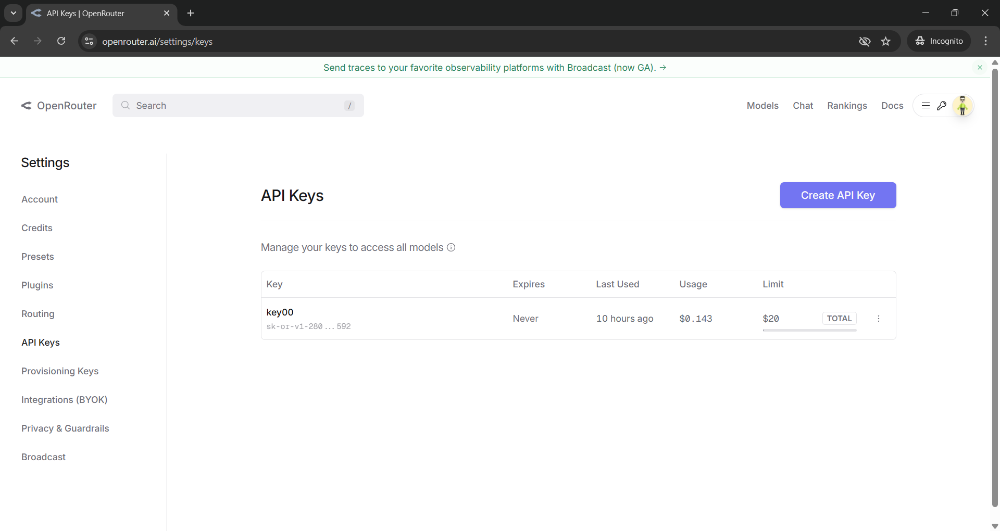
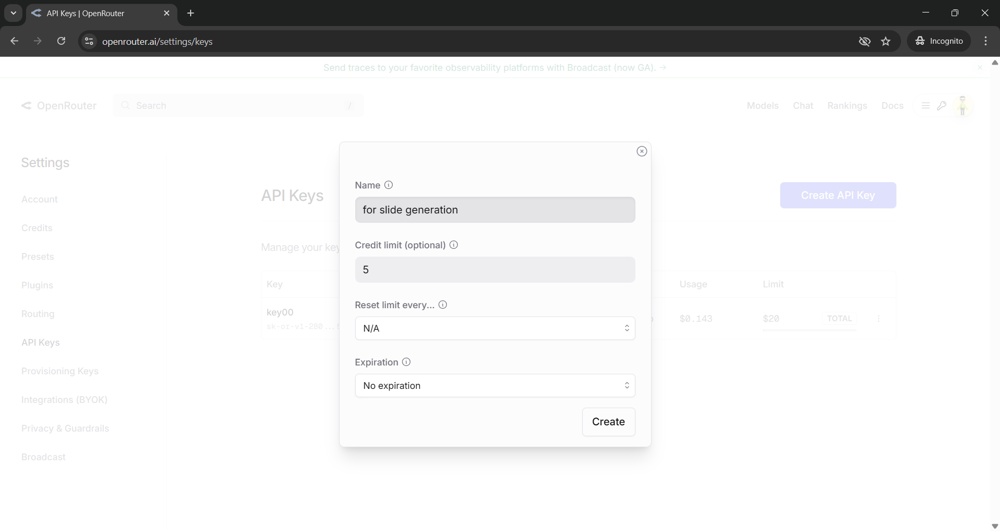

一旦創建，您將被分配一個新的 API 金鑰 (API Key)。*當使用 API 金鑰時，OpenRouter 將自動將 API 金鑰與該 API 金鑰使用上的任何限制匹配，如`Credit limit`。* 無論如何，***將金鑰複製到安全的地方以備後用。***

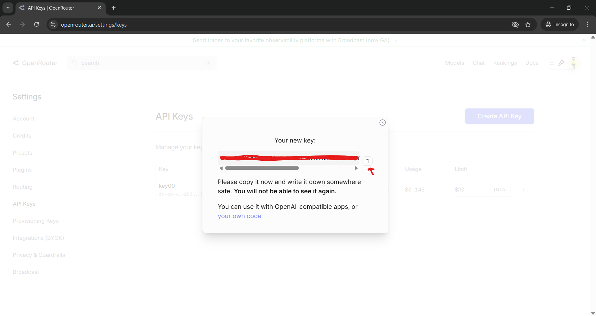

一旦頁面關閉，您就無法再次找出金鑰。如果您遺失了金鑰，您將必須生成一個新的金鑰。

# Pixabay 帳戶設置

您還需要設置一個免費的 [Pixabay](https://pixabay.com/api/docs/) 帳戶來獲取用於圖像來源獲取的 API 金鑰。
同樣，您可以使用您的 Google 帳戶進行註冊。

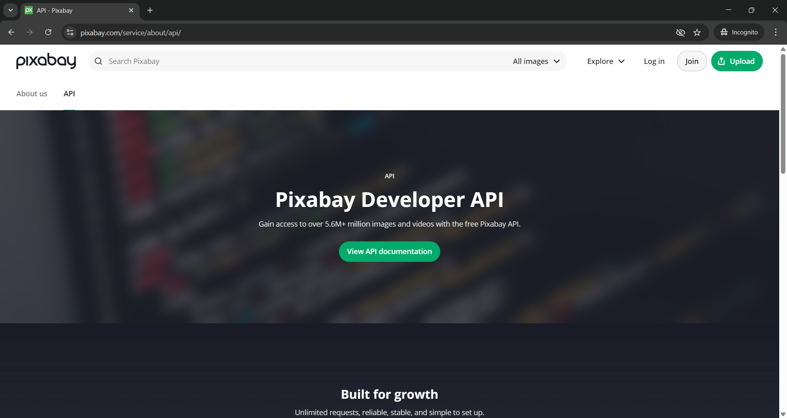
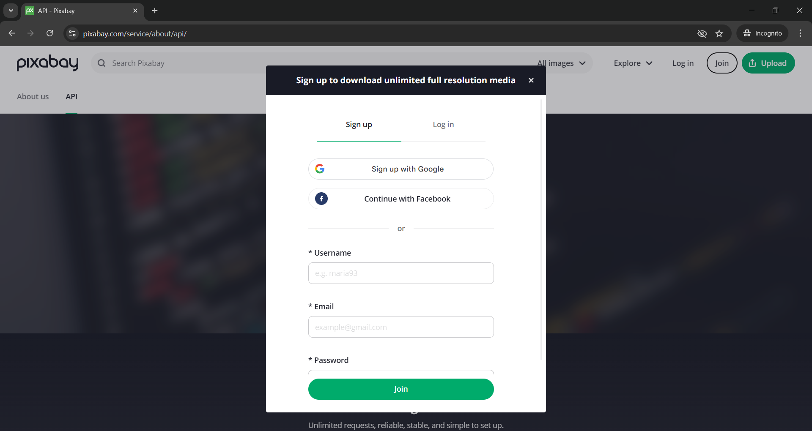

要找出分配給您帳戶的 API 金鑰，請轉到他們的 [API 文件](https://pixabay.com/api/docs/) 頁面。

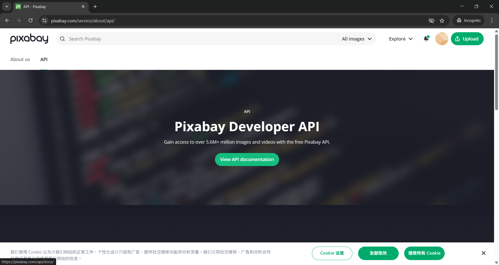
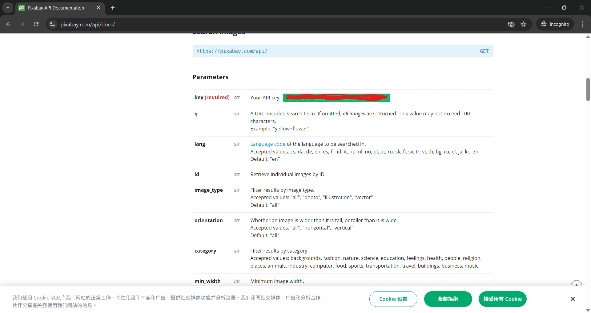

***要使用 Docker 設置 Presenton，您稍後需要此 API 金鑰 (API Key)。***


# Presenton 幻燈片生成示範

在進入部署之前，我將首先向您展示一個幻燈片生成示範會話。希望此示範能讓您了解可以獲得什麼樣的結果；更重要的是，您需要為獲得的結果支付多少費用的感覺。


我將用於幻燈片生成的提示是：

```
生動完整地詮釋基督教福音的真正意義
```


請注意，我選擇了 5 張繁體中文 (Traditional Chinese) 幻燈片。


儘管我可以提供額外的**支援文件**，但我將跳過此選項。

它首先要做的是生成幻燈片大綱，您可以仔細檢查（***您應該這樣做***）並在必要時進行編輯。

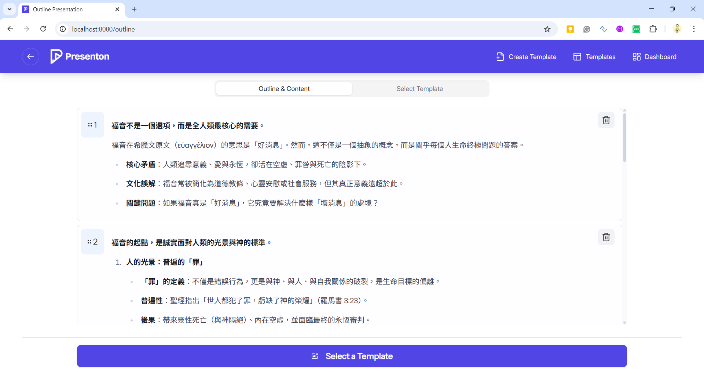

接下來，您需要為幻燈片選擇一個範本（截至當前版本，可選擇的範本不多 😔）

我將選擇第一個內建範本

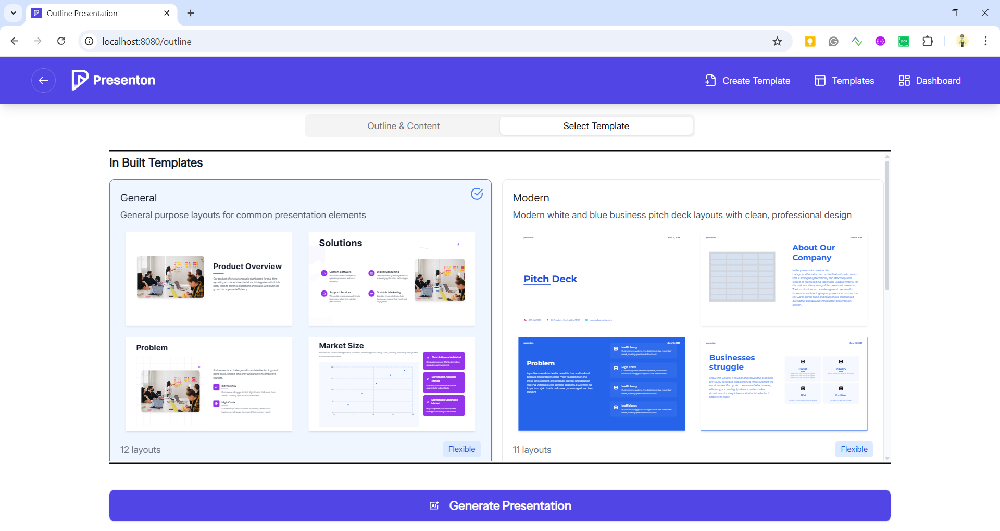

一段時間後，所有 5 張幻燈片都從大綱生成。

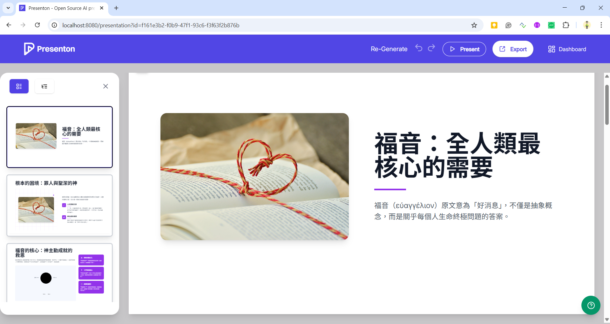

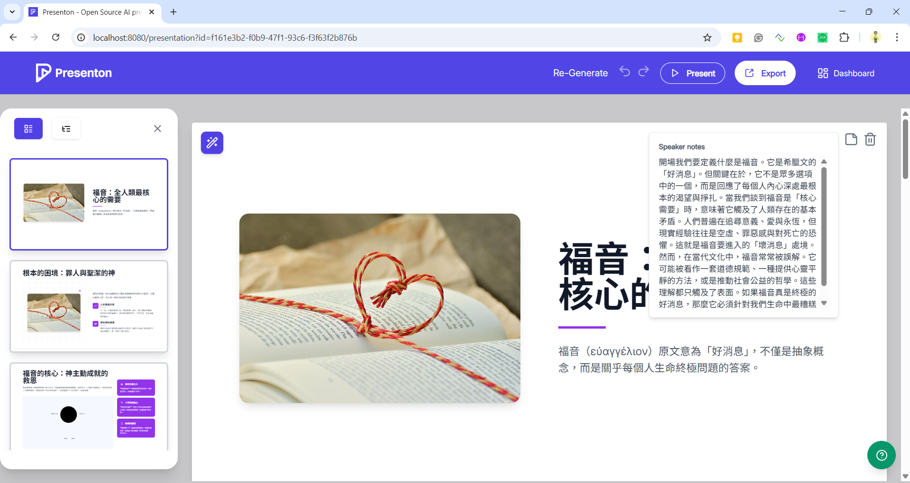

>請注意`Speaker notes`（您點擊幻燈片右上角的  來查看它們）

Presenton 還提供一些基本的編輯功能，供您修改生成的幻燈片。

例如，您可以將幻燈片上的圖像更改為另一張

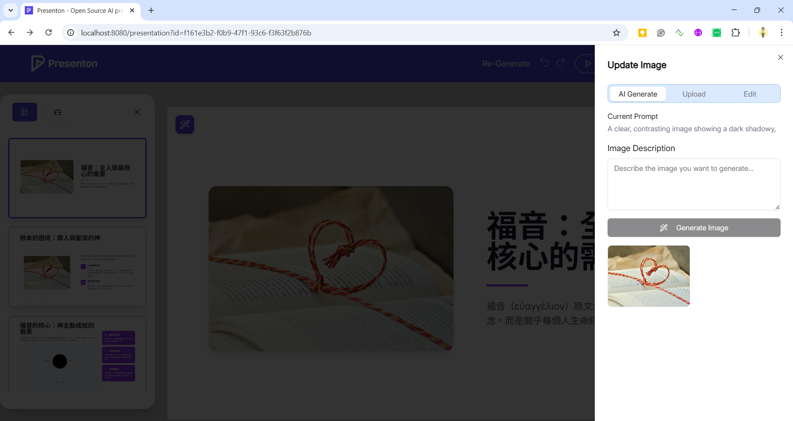

> 請注意，儘管提供的選項是`AI Generate`，但它似乎並不要求 OpenRouter 模型生成新圖像。相反，它似乎只是根據您輸入的`Image Description`從 Pixabay 獲取其他圖像。另一種選擇是從您的本地電腦上傳 (`Upload`) 您自己的圖像。

當然，您可以將幻燈片導 (`Export`) 出為`PPTX`（PowerPoint）格式，您可以使用 LibreOffice Impress（Microsoft PowerPoint 免費替代方案）在本地進一步編輯，或上傳到 Google Slides 進行線上編輯、分享等。

請注意，創建/生成的幻燈片存儲在您的 Docker *storage* 中。您可以從 `Dashboard` 返回幻燈片。

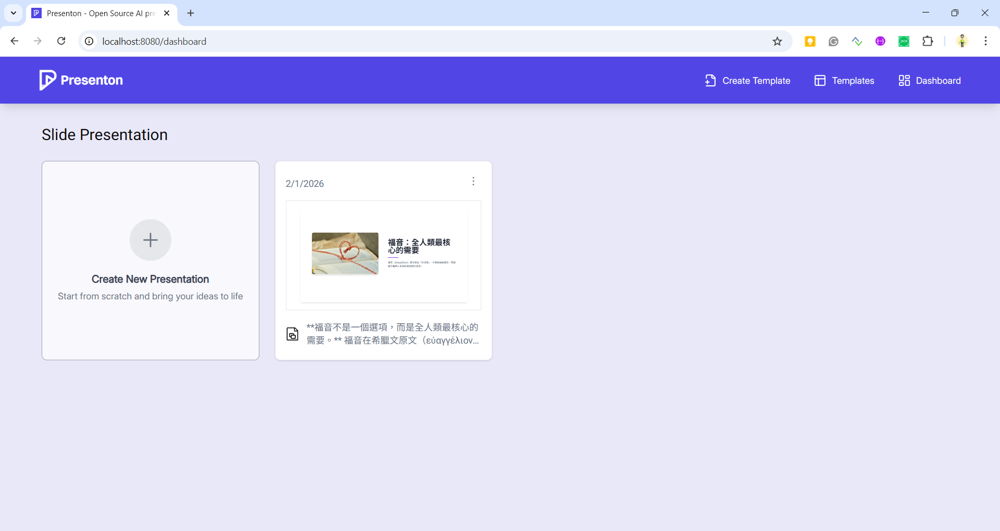


生成這 5 張幻燈片花費了我多少錢？基本上，接近零。
根據 OpenRouter 使用記錄，幻燈片生成調用了 `DeepSeek V3.2` 7 次

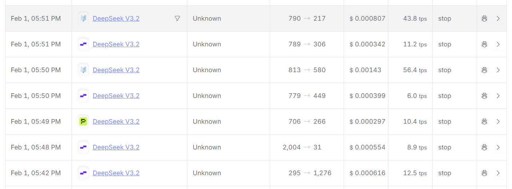


這 7 次 LLM 調用總共花費我大約 0.00445 美元


# 使用 Docker 本地部署 Presenton

如前所述，Presenton 可以本地部署到您的 Docker Desktop 安裝。您需要做的是

1) 創建一個資料夾，例如 `local_presenton`

2) 在資料夾中，您需要一個 Docker 配置檔案 -- 一個 `docker-compose.yml` 檔案 -- 您可以參考本 GitHub 倉庫中提供的 [`docker-compose.yml`](https://github.com/trevorwslee/presenton_local_docker_deployment_demo/blob/main/local_presenton/docker-compose.yml)
    ```
    ...
        container_name: presenton_demo
    ...
        ports:
          - "8080:80"
    ...  
          CUSTOM_LLM_URL: ${OPENAI_BASE_URL}
          CUSTOM_LLM_API_KEY: ${OPENAI_API_KEY}
          CUSTOM_MODEL: ${OPENAI_MODEL}
          IMAGE_PROVIDER: "pixabay"
          PIXABAY_API_KEY: ${PIXABAY_API_KEY}
    ...
    volumes:
      presenton_data:
    ```

3) 您還需要在同一資料夾中創建一個 `.env` 檔案，告訴 Docker 您的機密資訊，如您的 OpenRouter 和 Pixabay API 金鑰 (API keys)。您可以參考本 GitHub 倉庫中提供的範例 [`.env.example`](https://github.com/trevorwslee/presenton_local_docker_deployment_demo/blob/main/local_presenton/.env.example)
    ```
    OPENAI_API_KEY="....."
    OPENAI_BASE_URL="https://openrouter.ai/api/v1"
    OPENAI_MODEL="deepseek/deepseek-v3.2"
    PIXABAY_API_KEY="..."
    ```   
    您可以通過更改 `OPENAI_MODEL` 來更改要使用的模型。例如，您可以更改為使用 `qwen3-30b-a3b-instruct-2507`，如：
    ```
    ...
    OPENAI_MODEL="qwen/qwen3-30b-a3b-instruct-2507"
    ...
    ```
    您可以選擇的模型清單以及它們的計費費率可在 [OpenRouter Models](https://openrouter.ai/models) 找到

    例如

    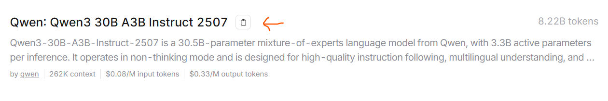

    > 請注意，您可以通過點擊  來複製模型名稱

打開 Command Prompt / PowerShell Terminal，將目錄更改為您創建的 `local_presenton` 資料夾，並運行以下命令在本地啟動 Presenton Docker 服務

```
docker-compose up -d
```


這將在本地部署 Presenton 作為 Docker 容器

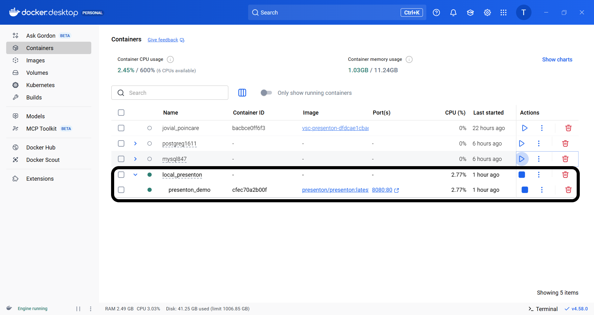

* `local_presenton` -- 資料夾名稱 -- 是您的 Docker 容器[群組]的名稱
* `presenton_demo` 是 Presenton Docker 容器的名稱

您的 Presenton 資料存儲在名為 `local_presenton_presenton_data` 的 Docker Desktop 管理*磁碟區*中

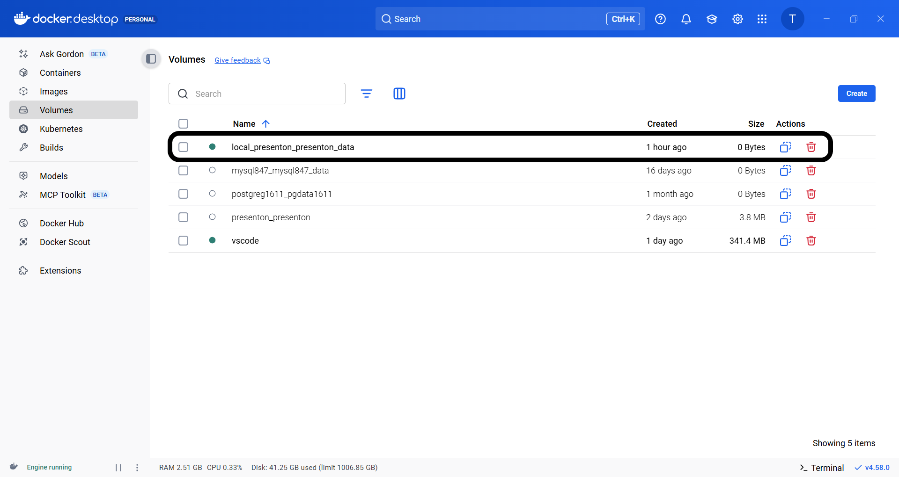


要打開您的本地 Presenton 部署（一個 web 應用程式），在您的瀏覽器中，前往 `http://localhost:8080`

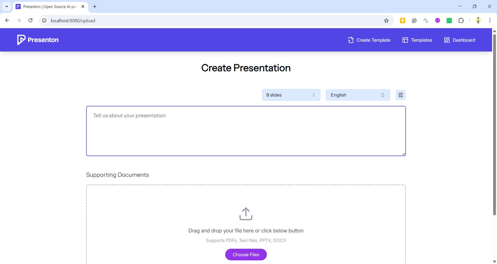


# Enjoy!

希望這個小示範能幫到您。 Have fun!


> Peace be with you!
> May God bless you!
> Jesus loves you!
> Amazing Grace!
